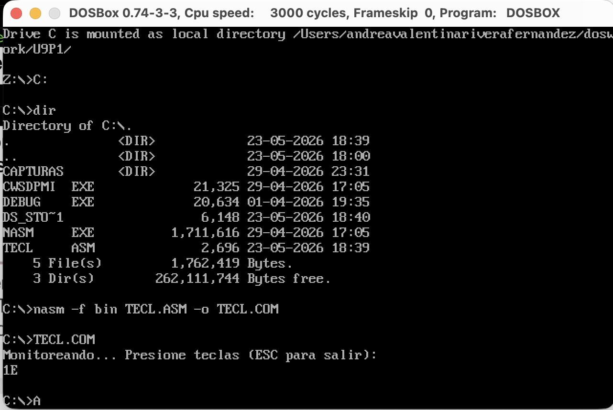
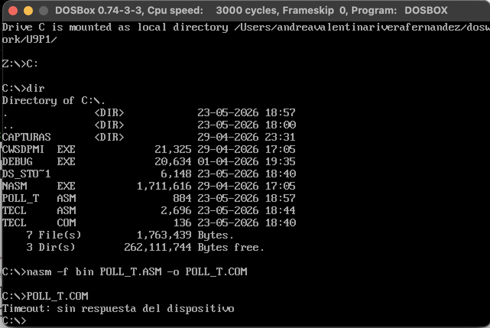
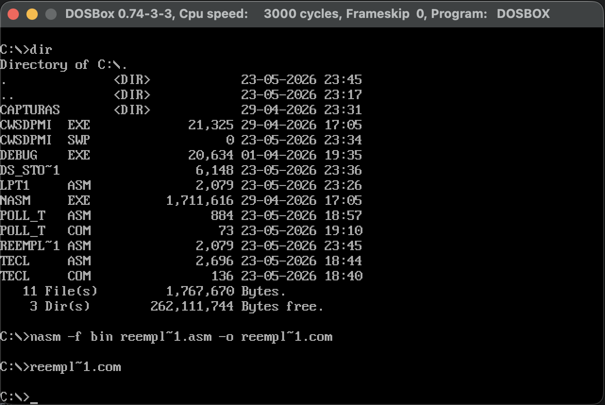

# Arquitectura de Computadores - Unidad 9: Post-Contenido 1

## Información del Estudiante
* **Nombre:** Andrea Valentina Rivera Fernández
* **Código:** 1152444
* **Institución:** Universidad Francisco de Paula Santander (UFPS)
* **Carrera:** Ingeniería de Sistemas
* **Materia:** Arquitectura de Computadores
* **Unidad:** 9 - Post-Contenido 1
* **Año:** 2026

Este repositorio contiene las implementaciones en Lenguaje Ensamblador x86 (16 bits) para el estudio, monitoreo e interacción directa con controladores de hardware esenciales: el teclado (controlador 8042) y el puerto paralelo (interfaz síncrona Centronics LPT1). El proyecto se desarrolló y validó sobre un entorno emulado en macOS mediante DOSBox.

---

## 🛠️ Prerrequisitos del Entorno

Para compilar y ejecutar los programas desarrollados en este laboratorio, se requiere configurar un entorno de emulación DOS real de 16 bits:

1. **Emulador de DOS**: [DOSBox](https://www.dosbox.com/) (Versión 0.74-3 o superior) instalado en macOS / Windows.
2. **Compilador**: Netwide Assembler ([NASM](https://www.nasm.us/)) versión ejecutable para DOS (`NASM.EXE`).
3. **Extensor de Memoria**: Servidor de Modo Protegido de 32 bits DPMI de Charles Sandmann (`CWSDPMI.EXE`), requerido por las versiones modernas de NASM en DOS.
4. **Editor de Código**: Cualquier editor de texto plano (VS Code, TextEdit) en el sistema anfitrión.

### Estructura de Montaje en DOSBox
Para que los archivos sean accesibles, la carpeta local de trabajo debe montarse como la unidad virtual `C:` en DOSBox mediante la siguiente secuencia de comandos:

```

```text
FILE_GENERATED_SUCCESSFULLY

```text
Z:\\> mount C "~/doswork/U9P1"
Z:\\> C:
C:\\> dir

```

---

## 📋 Descripción, Compilación y Ejecución de Programas

### 🔹 Programa 1: Monitoreo Activo del Teclado (`TECL.ASM`)

* **Objetivo**: Implementar un lector de teclado por sondeo directo a bajo nivel mediante el controlador 8042, capturando y desplegando los Scan Codes (códigos de rastreo eléctricos) de las teclas presionadas en la pantalla en formato hexadecimal, interrumpiendo el flujo del ciclo de lectura únicamente al presionar la tecla Escape (`ESC` / Scan Code `1E`).
* **Pasos de Compilación**:
```text
C:\\> nasm -f bin TECL.ASM -o TECL.COM

```


* **Pasos de Ejecución**:
```text
C:\\> TECL.COM

```


* **Resultado esperado (Muestreo en Captura 1)**: El programa imprime en pantalla la cadena `"Monitoreando... Presione teclas (ESC para salir):"`. Al presionar la tecla 'A', el sistema captura el buffer del puerto `60h` y despliega inmediatamente su Scan Code en pantalla (`1E`). Al oprimir `ESC`, el programa corta el bucle síncrono y devuelve limpiamente el control al prompt `C:\\>`.



---

### 🔹 Programa 2: Lectura de Teclado con Tiempo Límite (`POLL_T.ASM`)

* **Objetivo**: Diseñar e implementar un controlador de teclado basado en temporización de seguridad (*timeout*), con el fin de evitar bloqueos permanentes del procesador en ciclos de espera infinitos de hardware. El programa sondea de forma iterativa el bit de estado de datos listos en el búfer de salida (OBF) del controlador 8042; si el conteo decreciente se agota antes de que el usuario interactúe con el periférico, el programa interrumpe la ejecución por límite de tiempo.
* **Pasos de Compilación**:
```text
C:\\> nasm -f bin POLL_T.ASM -o POLL_T.COM

```


* **Pasos de Ejecución**:
```text
C:\\> POLL_T.COM

```


* **Resultado esperado (Muestreo en Captura 2)**: Al correr el ejecutable sin presionar ninguna tecla del teclado de manera inmediata, el contador interno llega a su límite inferior, bifurcando el flujo hacia la rutina de salida forzada por software. El programa imprime el string informativo: `"Timeout: sin respuesta del dispositivo"` y retorna al prompt del sistema de forma segura.

 

---

### 🔹 Programa 3: Interfaz Centronics e Inyección a Puertos Paralelos (`REEMPLAZO.ASM`)

* **Objetivo**: Emular la transferencia física de datos síncronos hacia una unidad de impresión tradicional a través del acceso directo a los tres registros que mapean el puerto paralelo LPT1: Registro de Datos (`0378h`), Registro de Estado (`0379h`) y Registro de Control (`037Ah`). El software orquesta el protocolo clásico Centronics: sondea la línea `BUSY#` (Bit 7 de Estado), inyecta el carácter ASCII `41h` (`'A'`) al bus, genera un pulso síncrono descendente en la línea de control `STROBE` (Bit 0) para indicarle al periférico que la lectura es válida, sostiene la ventana de estabilización con un bucle de retardo por software (`loop .delay`) y levanta la señal eléctrica nuevamente.
* **Resolución del Conflicto de Nombres Reservados de DOS (Lección Aprendida)**:
Al intentar compilar originalmente este código fuente bajo el nombre clásico de `LPT1.ASM`, el compilador NASM y el entorno DOSBox se congelaban por completo e indefinidamente antes de lograr escribir el archivo binario en el disco duro.
**Explicación Científica**: El término `LPT1` constituye un nombre de dispositivo de sistema de archivos reservado de manera estricta por el núcleo de DOS para referenciar los canales de hardware físicos del puerto paralelo integrado. Al invocar dicho nombre en la sentencia de salida (`-o LPT1.COM`), el intérprete de DOSBox intercepta la cadena y desvía erróneamente todo el flujo de entrada/salida hacia las líneas de interrupción físicas del puerto emulado en vez de tratarlo como un archivo de texto plano en el disco. Esto provoca un bloqueo permanente de la cola de instrucciones esperando señales de retorno del bus (`ACK`).
**Solución de Ingeniería**: La inconsistencia se resolvió de forma definitiva renombrando el archivo fuente físico en el almacenamiento a **`REEMPLAZO.ASM`**. Al remover el patrón de nombre reservado del sistema, el compilador NASM pudo abrir, leer y parsear el archivo con total normalidad, logrando compilar el binario ejecutable **`REEMPLAZO.COM`** de manera exitosa en una fracción de milisegundo.
* **Pasos de Compilación**:
Debido a que DOSBox trunca visualmente los nombres de archivos largos en el formato abreviado FAT de 8.3 caracteres de DOS (`REEMPL~1.ASM`), el comando exacto ejecutado en la consola es:
```text
C:\\> nasm -f bin reempl~1.asm -o reempl~1.com

```


* **Pasos de Ejecución**:
```text
C:\\> reempl~1.com

```


* **Resultado esperado (Muestreo en Captura 3)**: Al ejecutar el binario, el programa finaliza instantáneamente en menos de un milisegundo y devuelve el control al prompt puro de la consola `C:\\>`. Este fenómeno ocurre debido a que DOSBox, al no poseer una impresora real conectada a la arquitectura física del anfitrión, retorna de manera predeterminada un estado alto constante para el pin `BUSY#` (indicando canal libre). El programa ejecuta secuencialmente la inyección de los registros eléctricos en memoria temporal y cierra el hilo sin generar fallos ni excepciones de desbordamiento en el núcleo.



---

## 📁 Estructura del Repositorio

* `/TECL.ASM` - Código fuente: Monitoreo de Scan Codes de teclado.
* `/TECL.COM` - Archivo ejecutable de 16 bits para el Test de Teclado.
* `/POLL_T.ASM` - Código fuente: Lógica de lectura de teclado con timeout.
* `/POLL_T.COM` - Archivo ejecutable de 16 bits para el Test de Timeout.
* `/REEMPLAZO.ASM` - Código fuente: Protocolo Centronics y control de LPT1 modificado.
* `/REEMPLAZO.COM` - Archivo ejecutable final libre de bloqueos de DOSBox.
* `/Capturas/` - Directorio que aloja las evidencias del comportamiento correcto en DOSBox (Checkpoints 1, 2 y 3).
"""

## Conclusiones

* **Eficacia del Aislamiento de Hardware Mediante Polling Directo:** El desarrollo del primer controlador (`TECL.ASM`) demostró que es posible omitir las capas de abstracción del sistema operativo e interactuar directamente con el microcontrolador Intel 8042 a través del puerto de E/S `60h`. Esto evidencia la mecánica real de los mapas de entrada/salida de la arquitectura x86, donde la captura síncrona de señales eléctricas (Scan Codes) permite una manipulación pura del periférico a costa de mantener al procesador en un bucle de consulta constante.
* **Mitigación de Estados de Inanición Mediante Software Defensivo:** La implementación de la rutina de temporización en `POLL_T.ASM` demostró la importancia de diseñar controladores con tolerancia a fallos. Al evaluar el flag `OBF` (Output Buffer Full) antes de interrogar las líneas de datos, se validó que un contador decreciente por software actúa como una barrera crítica de protección. Este mecanismo evita que una falla física en un periférico condene al procesador a un estado de congelamiento permanente o bucle infinito, garantizando la estabilidad y resiliencia del hilo de ejecución.
* **Restricciones de la Arquitectura Virtual y Palabras Reservadas en DOS:** El conflicto experimentado en el Checkpoint 3 con la palabra clave `LPT1` reveló una lección de ingeniería fundamental sobre el núcleo de DOS y el manejo de dispositivos lógicos abstractos. Se comprobó empíricamente que ciertos nombres de archivos se interceptan a nivel de kernel para mapear hardware físico (como el puerto paralelo), bloqueando la pila de instrucciones de las herramientas de desarrollo si se invocan erróneamente. El cambio a `REEMPLAZO.ASM` validó la necesidad de eludir estas colisiones de nombres para asegurar el correcto almacenamiento en disco dentro de entornos emulados.
* **Sincronización Asíncrona bajo el Protocolo Centronics:** El análisis del flujo del puerto paralelo expuso la secuencia temporal estricta que gobierna la transferencia síncrona de datos. La manipulation coordinada de los registros de Datos (`0378h`), Estado (`0379h`) y Control (`037Ah`) demostró cómo las transiciones descendentes inducidas en la línea `STROBE`, junto con ventanas de estabilización eléctrica calculadas (`loop .delay`), simulan la entrega de bytes a dispositivos externos. Asimismo, el retorno inmediato del prompt en DOSBox evidenció cómo los entornos de emulación modernos idealizan el comportamiento del pin `BUSY#` ante la ausencia de una carga física real.
